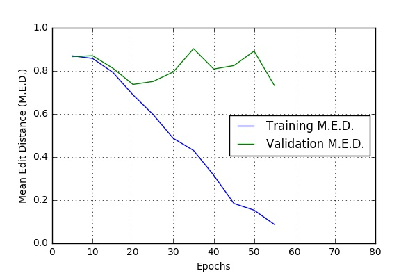
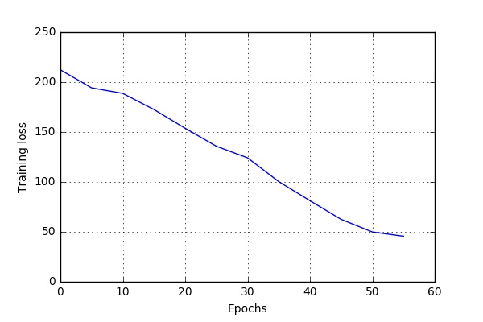
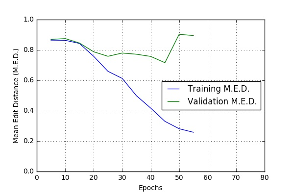

# Audio and Visual Speech Recognition(AVSR) using Deep Learning

_This is my [Google Summer of Code 2017](https://summerofcode.withgoogle.com/projects/#5019227963523072) Project with [the Distributed Little Red Hen Lab](http://www.redhenlab.org/)._

The aim of this project is to develop a working Speech to Text module for the Red Hen Lab’s current [Audio processing pipeline](https://github.com/RedHenLab/Audio). The initial goal is to extend current [Deep Speech model](https://github.com/mozilla/DeepSpeech)(audio only) to Red Hen lab's TV news videos datasets.

Now, it is common for news videos to incorporate both auditory and visual modalities. Developing a multi-modal Speech to Text model seems very tempting for these datasets. The next goal is to develop a multi-modal Speech to Text system (AVSR) by extracting visual modalities and concatenating them to the previous inputs.

This project is based on the approach discussed in paper [Deep Speech](https://arxiv.org/abs/1412.5567). This paper discusses speech recognition using audio modality only, hence this project can be seen as an extension to Deep Speech model.

## Getting Started

### Prerequisites

* **For Audio-only Speech Recognition**:
	* [Git Large File Storage](https://git-lfs.github.com/)
	* [TensorFlow 1.0 or above](https://www.tensorflow.org/install/)
	* [SciPy](https://scipy.org/install.html)
	* [PyXDG](https://pypi.python.org/pypi/pyxdg)
	* [python_speech_features](https://pypi.python.org/pypi/python_speech_features)
	* [python sox](https://pypi.python.org/pypi/sox)
	* [pandas](https://pypi.python.org/pypi/pandas#downloads)
	* [FFmpeg](https://www.ffmpeg.org/download.html)

* **For Audio-Visual Speech Recognition**:

	In addition to above requirements, you will also require:
	* [OpenCV 3.x for Python](http://docs.opencv.org/trunk/d7/d9f/tutorial_linux_install.html)
	* [scikit-image](http://scikit-image.org/download.html)
	* [Dlib for Python](http://www.pyimagesearch.com/2017/03/27/how-to-install-dlib/)

### Installing

* Firstly, install [Git Large File Storage(LFS) Support](https://git-lfs.github.com/) and [FFmpeg](https://www.ffmpeg.org/download.html).
* For video based speech recognition (lip reading), you will also require [OpenCV 3.x](http://docs.opencv.org/trunk/d7/d9f/tutorial_linux_install.html) and [dlib](http://www.pyimagesearch.com/2017/03/27/how-to-install-dlib/) for python. 
* Open terminal and type following commands.
	```bash
	$ git clone https://github.com/pandeydivesh15/AVSR-Deep-Speech.git
	$ cd AVSR-Deep-Speech
	$ pip install -r requirements.txt 
	```

## Data-Preprocessing for Training

Please note that these data-preprocessing steps are only required if your training audio/video files are quite long (> 1 min). **If you have access to shorter wav files (length in secs) and their associated transcripts, you will not require any data-preprocessing** (you must have CSV files too, see [bin/import_ldc93s1.py](./bin/import_ldc93s1.py) for downloading one example dataset). In case you have longer audio/video files, it is suggested to use data-preprocessing.

These steps require videos/audios and their associated time-aligned transcripts. Time aligned time stamps for your audios/videos can be found using [Gentle](https://github.com/lowerquality/gentle/) or [Red Hen Lab's Audio Pipeline](https://github.com/RedHenLab/Audio/tree/master/Pipeline) or any other alignment application.

Store time-aligned timescripts as json files. The json file should be of the format: [Click here](https://gist.github.com/pandeydivesh15/2012ab10562cc85e796e1f57554aca33).

**Note**: By default, the project assumes that all .mp4(video) files are kept at [data/RHL_mp4](./data/RHL_mp4), json files at [data/RHL_json](./data/RHL_json) and all wav files at [data/RHL_wav](./data/RHL_wav). If you would like to change the defaults, change the associated variables at [bin/preprocess_data_audio.py](./bin/preprocess_data_audio.py).

#### Audio-only Speech Recognition

[bin/preprocess_data_audio.py](./bin/preprocess_data_audio.py) expects 5 positional arguments.

Argument			|	Description 
---					|	---
output_dir_train	|	Output dir for storing training files (with trailing slash)
output_dir_dev		|	Output dir for storing files for validation (with trailing slash)
output_dir_test		|	Output dir for storing test files (with a trailing slash)
train_split			|	A float value for deciding percentage of data split for training the model
dev_split			|	A float value for deciding percentage of validation data
test_split			|	A float value for deciding percentage of test data

Have a look at [bin/preprocess_audio.sh](./bin/preprocess_audio.sh), for a sample usage. This script runs [bin/preprocess_data_audio.py](./bin/preprocess_data_audio.py) with default storage locations and default data split percentages. 

From the main project's directory, open terminal and type:

```bash
$ ./bin/preprocess_audio.sh
```

After this step, all prepared data files(train, dev, test) will be stored in data/clean_data folder.

#### Audio Visual Speech Recognition (AVSR)

##### Preparing data for training AutoEncoder

[bin/preprocess_auto_enc.py](./bin/preprocess_auto_enc.py) expects 2 necessary positional args and 2 optional args.

Pos. Arguments		|	Description
---					|	---
video_dir			|	Output dir for storing training files (with trailing slash)
output_dir			|	Output dir for storing files for validation (with trailing slash)

Optional 			|	Description
---					|	---
--max_videos n		|	`n` = number of videos to be used for preprocessing. (Default = 1)
--screen_display	|	Determines whether to display the video being processed.

Have a look at [bin/preprocessing_AE.sh](./bin/preprocessing_AE.sh). This script runs [bin/preprocessing_AE.sh](./bin/preprocessing_AE.sh) with default values. 

From the main project's directory, open terminal and type:

```bash
$ ./bin/preprocessing_AE.sh
```


## Training

#### Original DeepSpeech

The original [Deep Speech model](https://github.com/mozilla/DeepSpeech), provided many command line options. To view those options, directly open the [main script](./DeepSpeech.py) or you can also type:
```bash
$ ./DeepSpeech.py --help 
```

To run the original Deep Speech code, with a sample dataset (called LDC93S1) and default settings, run:

```bash
$ ./bin/run-ldc93s1.sh
```
This script first installs the LDC93S1 dataset at data/ldc93s1/. Afterward, it runs DeepSpeech.py. It trains on LDC93S1 dataset, outputs stats for each epoch, and finally outputs WER report for any dev or test data.

#### DeepSpeech_RHL.py

Any code modifications for Red Hen Lab will be reflected in [**DeepSpeech_RHL.py**](./DeepSpeech_RHL.py). One such modification is that DeepSpeech_RHL.py allows transcripts to have digits[0-9] too, unlike original [DeepSpeech.py](./DeepSpeech.py).

To run modified DeepSpeech on your system (with default settings), open terminal and run:

```bash
$ ./bin/run_case_HPC.sh

# This script trains on your data (placed at data/clean_data/), 
# and finally exports model at data/export/.
```
```bash
$ ./bin/run-ldc93s1_RHL.sh

# This script runs on LDC93S1 dataset. It doesn't exports any model.
```

Feel free to modify any of the above scripts for your use.

## Checkpointing

During training of a model so called checkpoints will get stored on disk. This takes place at a configurable time interval. The purpose of checkpoints is to allow interruption (also in case of some unexpected failure) and later continuation of training without loosing hours of training time. Resuming from checkpoints happens automatically by just (re)starting training with the same `--checkpoint_dir` of the former run.

Be aware however that checkpoints are only valid for the same model geometry they had been generated from. In other words: If there are error messages of certain `Tensors` having incompatible dimensions, this is most likely due to an incompatible model change. One usual way out would be to wipe all checkpoint files in the checkpoint directory or changing it before starting the training. 

## Some Training Results

#### Audio-only Speech Recognition

Here are some of the results I obtained while running the code at [CWRU HPC](https://sites.google.com/a/case.edu/hpc-upgraded-cluster/). The script [bin/run_case_HPC.sh](./bin/run_case_HPC.sh) was used to get these results.

These results are based on a **one hour** long audio file. The file was split into 634 .wav files (See [Data-Preprocessing](#data-preprocessing-for-training)). 90% files were used for training and 5% each for validation and testing.

* Variable Dropouts for feedforward layers

	**dropout_rate = 0.05**

	 

	<p align="center"></p>

	**dropout_rate = 0.10**

	 

	<p align="center"></p>

## Exporting model and Testing

If the `--export_dir` parameter is provided to DeepSpeech_RHL.py, a model will have been exported to this directory during training. This exported model can then be used for predicting transcripts for new audio/video files.

For running an exported model for new inputs, see [run_exported_model_audio.py](./bin/run_exported_model_audio.py). This python script allows four optional arguments.

Argument			|	Description 
---					|	---
-d, --export_dir	|	Dir where the trained model's meta graph and data were exported
-wd, --wav_dir		|	Dir where wav files are stored (all files' transcripts will be generated)
-af, --wav_file		|	Wav file's location. Only one transcript generated. If --wav_dir is given, --wav_file will have no effect.
-vf, --video_file	|	Video file's location. Only one transcript generated. If --wav_dir or --wav_file are also given as args, --video_file will have no effect.
-n, --model_name	|	Name of the model exported

Options				|	Description
---					|	---
--use_spell_check	|	Decide whether to use spell check system for decoded transcripts from RNN. If option is given, spell correction system (KenLM) will be used.

* For running an exported model with default settings, run:

	```bash
	$ python ./bin/run_exported_model_audio.py
	```

	Note: This script, by default, runs on data/ldc93s1/LDC93S1.wav file. In case you dont have LDC93S1 dataset downloaded, run: ```$ python -u bin/import_ldc93s1.py ./data/ldc93s1```

* Using command line options for running exported model:

	```bash
	$ python ./bin/run_exported_model_audio.py -d path_to_exported_model/ -n model_name -af /path_to_wav_file/file.wav 

	# This finds transcript for given audio .wav file.
	```

	```bash
	$ python ./bin/run_exported_model_audio.py -d path_to_exported_model/ -n model_name -vf /path_to_video_file/file.mp4 

	# This finds transcript for given video file.
	```


## Acknowledgments

* [Google Summer of Code 2017](https://summerofcode.withgoogle.com/)
* [Red Hen Lab](http://www.redhenlab.org/)
* [Mozilla's DeepSpeech](https://github.com/mozilla/DeepSpeech)
* [Deep Speech Paper](https://arxiv.org/abs/1412.5567)
* [Deep complementary bottleneck features for visual speech recognition](https://ibug.doc.ic.ac.uk/media/uploads/documents/petridispantic_icassp2016.pdf)
* [Reducing the Dimensionality of Data with Neural Networks](https://www.cs.toronto.edu/~hinton/science.pdf)
* [rbm-ae-tf](https://github.com/Cospel/rbm-ae-tf), [tensorfow-rbm](https://github.com/meownoid/tensorfow-rbm)
